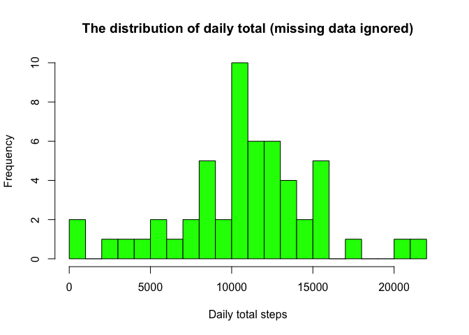
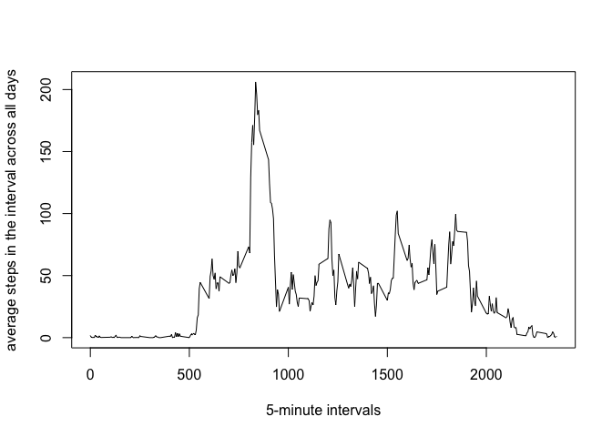
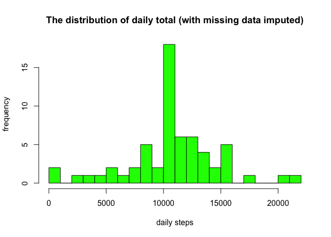

# Reproducible Research: Peer Assessment 1

## Loading and preprocessing the data

```r
setwd("/Users/mstaneluis/Workspace/Coursera/RepData_PeerAssessment1")
cls = c("integer", "character", "integer")
df <- read.csv("activity.csv", head=TRUE, colClasses=cls, na.strings="NA")
head(df)
```

```
##   steps       date interval
## 1    NA 2012-10-01        0
## 2    NA 2012-10-01        5
## 3    NA 2012-10-01       10
## 4    NA 2012-10-01       15
## 5    NA 2012-10-01       20
## 6    NA 2012-10-01       25
```

```r
df$date <- as.Date(df$date)
df_ign <- subset(df, !is.na(df$steps))
```

## What is mean total number of steps taken per day?

```r
daily_sum <- tapply(df_ign$steps, df_ign$date, sum, na.rm=TRUE, simplify=T)
daily_sum <- daily_sum[!is.na(daily_sum)]

hist(x=daily_sum,col="green",breaks=20,xlab="Daily total steps",ylab="Frequency",main="The distribution of daily total (missing data ignored)")
```



## What is the average daily activity pattern?

```r
mean(daily_sum)
```

```
## [1] 10766.19
```

```r
median(daily_sum)
```

```
## [1] 10765
```

```r
int_avg <- tapply(df_ign$steps, df_ign$interval, mean, na.rm=TRUE, simplify=T)
df_ia <- data.frame(interval=as.integer(names(int_avg)), avg=int_avg)

with(df_ia,
     plot(interval,
          avg,
          type="l",
          xlab="5-minute intervals",
          ylab="average steps in the interval across all days"))
```



```r
max_steps <- max(df_ia$avg)
df_ia[df_ia$avg == max_steps, ]
```

```
##     interval      avg
## 835      835 206.1698
```

## Imputing missing values

```r
sum(is.na(df$steps))
```

```
## [1] 2304
```

```r
df_impute <- df
ndx <- is.na(df_impute$steps)
int_avg <- tapply(df_ign$steps, df_ign$interval, mean, na.rm=TRUE, simplify=T)
df_impute$steps[ndx] <- int_avg[as.character(df_impute$interval[ndx])]
new_daily_sum <- tapply(df_impute$steps, df_impute$date, sum, na.rm=TRUE, simplify=T)

hist(x=new_daily_sum,
     col="green",
     breaks=20,
     xlab="daily steps",
     ylab="frequency",
     main="The distribution of daily total (with missing data imputed)")
```



```r
mean(new_daily_sum)
```

```
## [1] 10766.19
```

```r
median(new_daily_sum)
```

```
## [1] 10766.19
```

## Are there differences in activity patterns between weekdays and weekends?

```r
is_weekday <- function(d) {
  wd <- weekdays(d)
  ifelse (wd == "Saturday" | wd == "Sunday", "weekend", "weekday")
}

wx <- sapply(df_impute$date, is_weekday)
df_impute$wk <- as.factor(wx)
head(df_impute)
```

```
##       steps       date interval      wk
## 1 1.7169811 2012-10-01        0 weekday
## 2 0.3396226 2012-10-01        5 weekday
## 3 0.1320755 2012-10-01       10 weekday
## 4 0.1509434 2012-10-01       15 weekday
## 5 0.0754717 2012-10-01       20 weekday
## 6 2.0943396 2012-10-01       25 weekday
```

```r
wk_df <- aggregate(steps ~ wk+interval, data=df_impute, FUN=mean)

library(lattice)
xyplot(steps ~ interval | factor(wk),
       layout = c(1, 2),
       xlab="Interval",
       ylab="Number of steps",
       type="l",
       lty=1,
       data=wk_df)
```


